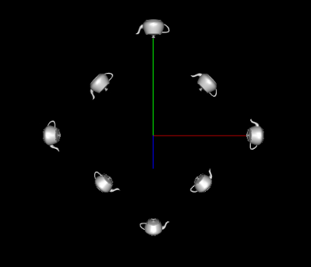
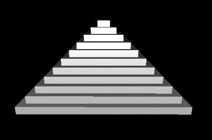
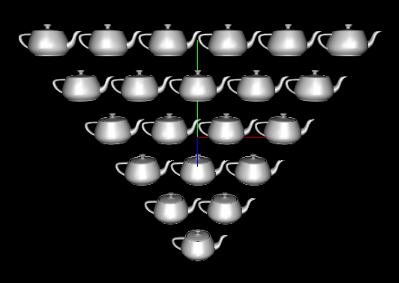
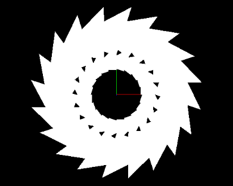

# OpenGL 3D Transformations

Recreates four 3D scenes using OpenGL transformation mechanisms: a rotated square of teapots, an 11-step pyramid, an inverted triangle of teapots, and an original nested spiral of triangles.

Built for COSC 4370 (Computer Graphics) at the University of Houston.

## Concepts
- glTranslatef / glRotatef / glScalef transformations
- Nested transformation matrices with glPushMatrix / glPopMatrix
- Procedural scene generation with loops
- Immediate mode OpenGL rendering

## Files
- `main.cpp` — Scene construction and transformation logic
- `Report.pdf` — Implementation writeup with rendered outputs

## Output

